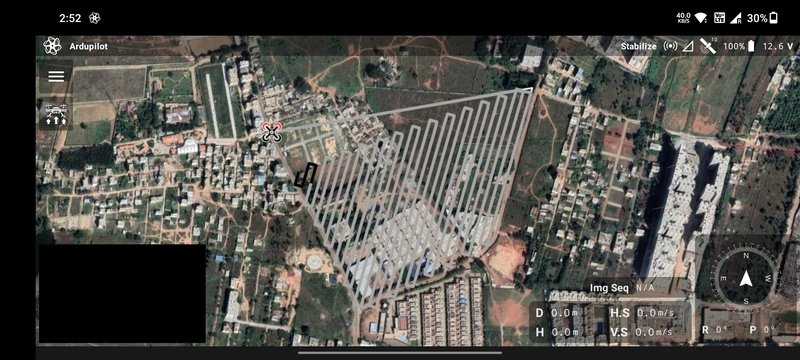
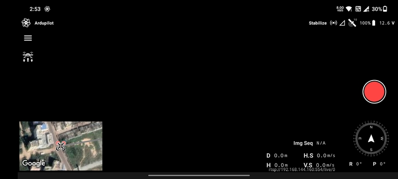
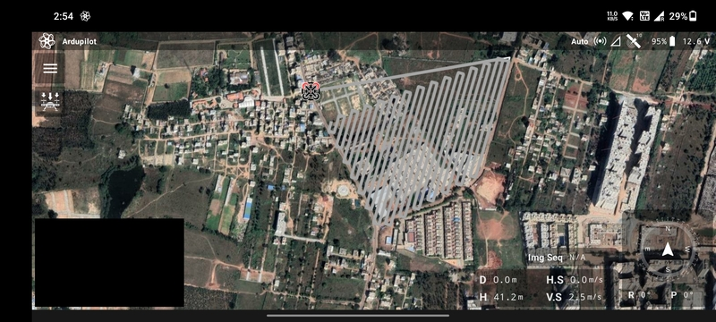
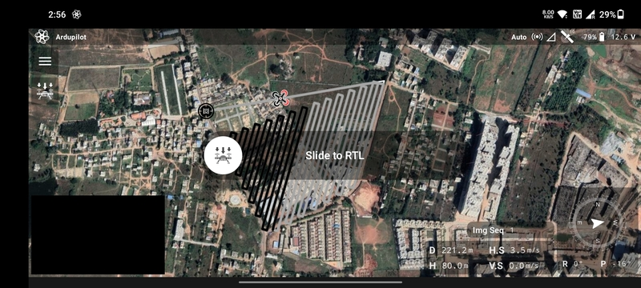
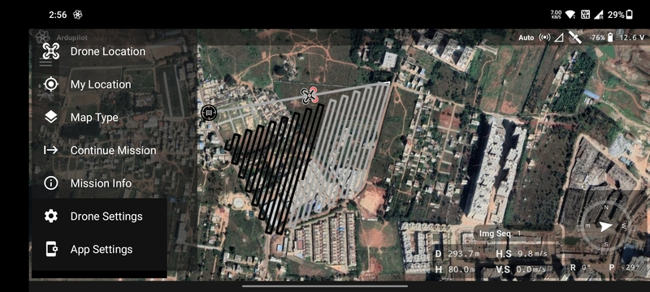

# Flight Screen

This is the screen which provides the interface to takeoff, conduct in-flight operations and land the drone. Flights can
be conducted in two ways:

- Manual flight
- Automated mission flight

In the case of an automated mission, the map is zoomed into the path planned in the
[Mission Planning Screen](./mission-planning-screen.md).

## Head-up Display

Present at the bottom right part of the screen are present some important in-flight telemetry details.

- `D`: Distance from home/takeoff location in meter.
- `H`: Altitude from home/takeoff location in meter.
- `H.S`: Horizontal speed in meter per second.
- `V.S`: Vertical speed in meter per second.
- `Img Seq`: Index of the photo taken in a particular power cycle.
- `R`: Roll angle in degree.
- `P`: Pitch angle in degree.
- `Compass`: Heading of the drone.

## Camera

The video stream can be viewed in the camera present at the bottom left part of the screen. You can click it to expand
the camera and replace the map with it.

### Take Photo Button

The red colored button at the mid right part of the camera screen can be used to take a photo from the drone. When
clicked, two actions take place:

- If the camera on the drone is configured to take commands from the flight controller to take photos, then it will take
  a photo and save in on the camera's SD card.
- A screen shot of the camera is taken and saved on the transmitter/phone.

## Upload Button

The icon below the menu button on the top left corner of the screen is the mission upload button. The preflight checks
will be conducted shown when you tap it.

### Preflight

There are 6 preflight check that need to ticked so that you can launch the drone.

- `Drone Connected`: The drone connected to the transmitter.
- `Drone Health`: Indicates if the sensors are calibrated and ready for flight.
- `GPS Satellites`: The GPS is receiving data from enough satellites to estimate the position correctly.
- `Battery Level`: Whether there is enough battery to execute the mission.
- `Mission Uploaded`: Indicates if the mission has been uploaded to the drone.
- `NPNT Approved`: Currently disabled. This will be enabled once the no permission no takeoff protocol is in place.

### RTL Altitude

You can select the RTL altitude but moving the scroll bar on the right side of the preflight checks.

### Slide to Launch

This is how the screen will look once all the preflight checks are cleared.

The `Pre-Flight Checks in Progress` will change to `Slide to Launch`.

## Takeoff

The drone will takeoff as shown in the image given below.

You can clearly see the drone on the map and the distance from the home/takeoff location and its altitude. The red color
represents the front side of the drone.

## Return to Launch

When in air, the mission upload button becomes the RTL button. You can tap it to access the `Slide to RTL` dialog as
shown in the image below.  

## Menu

The menu button on the top left corner has the following options:

- `Drone Location`: Zoom into the location of the drone.
- `My Location`: Zoom into the location of the transmitter.
- `Map Type`: Switch between satellite and normal map types.
- `Continue Mission`: Continue the mission from the last waypoint in case it was interrupted.
- `Mission Info`: Information about the current mission.
- [`Drone Settings`](/docs/launchpad/settings/drone-settings.md)
- [`App Settings`](/docs/launchpad/settings/app-settings.md)

